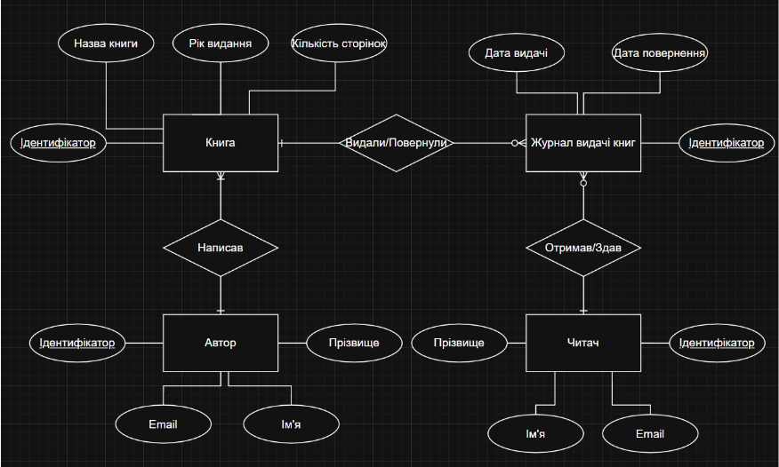
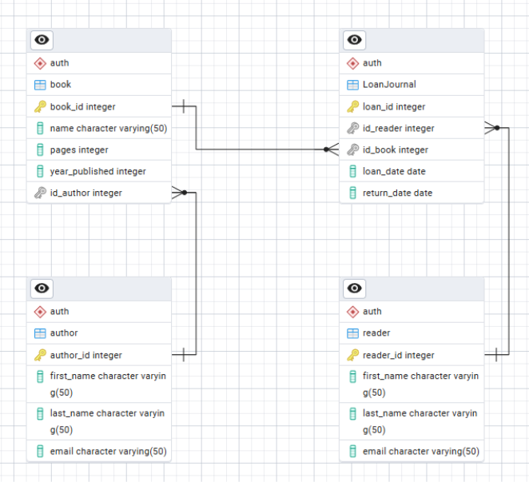

 # Розрахунково-графічна робота: Консольний додаток для СУБД PostgreSQL

**Виконавець:** Богдан Іваха
**Телеграм:** @bohdanivakha

---

## 1. Про проєкт

Цей проєкт є консольним додатком на **Python**, який реалізує CRUD-операції (Create, Read, Update, Delete), складні пошукові запити та масову генерацію даних для бази даних у **PostgreSQL**.

Додаток розроблено за архітектурним шаблоном **MVC (Model-View-Controller)**:
* **Model**: Відповідає за всю логіку взаємодії з базою даних (чисті SQL-запити через бібліотеку **Psycopg 2**).
* **View**: Відповідає за відображення інформації в консолі (меню, списки, повідомлення, валідація вводу).
* **Controller**: Керує потоком програми, приймає ввід користувача та зв'язує Model і View.

---

## 2. Структура Бази Даних

**Тема БД:** «Бібліотечна система управління книгами»

### Сутності та їх опис

* **Автор**
    * **Призначення:** Зберігає дані про авторів, яким належать книги.
    * **Атрибути:** Прізвище, ім’я, поштова скринька (email), ідентифікатор (id).
* **Книга**
    * **Призначення:** Містить інформацію про книги, що доступні у бібліотеці.
    * **Атрибути:** Назва, рік видання, автор, кількість сторінок, ідентифікатор (id).
* **Читач**
    * **Призначення:** Зберігає відомості про користувачів бібліотеки.
    * **Атрибути:** Прізвище, ім’я, поштова скринька(email), ідентифікатор (id).
* **Журнал видачі книг**
    * **Призначення:** Реєструє факти отримання книг читачами, містить інформацію про дату видачі та повернення.
    * **Атрибути:** Читач, Книга, дата видачі, дата повернення, ідентифікатор (id).

### ER-діаграма (Сутність-Зв'язок)

### Реляційна схема (Фізична модель)

### Реляційна схема (Опис таблиць)

**`auth.author`**
* `author_id` (integer, PK, AI)
* `last_name` (text, NOT NULL)
* `first_name` (text, NOT NULL)
* `email` (text, UNIQUE)

**`auth.book`**
* `book_id` (integer, PK, AI)
* `name` (text, NOT NULL)
* `year_published` (integer)
* `pages` (integer)
* `id_author` (integer, FK -> author.author_id)

**`auth.reader`**
* `reader_id` (integer, PK, AI)
* `last_name` (text, NOT NULL)
* `first_name` (text, NOT NULL)
* `email` (text, UNIQUE)

**`auth."LoanJournal"`**
* `loan_id` (integer, PK, AI)
* `id_book` (integer, NOT NULL, FK -> book.book_id)
* `id_reader` (integer, NOT NULL, FK -> reader.reader_id)
* `loan_date` (date, NOT NULL)
* `return_date` (date)

---

## 3. Технології

* **Мова програмування:** Python 3.11
* **Система управління базами даних (СУБД):** PostgreSQL
* **Інструмент БД:** PgAdmin4
* **Бібліотеки Python:**
    * **Psycopg 2** (для взаємодії з БД)
    * **time** (для вимірювання швидкодії запитів)
